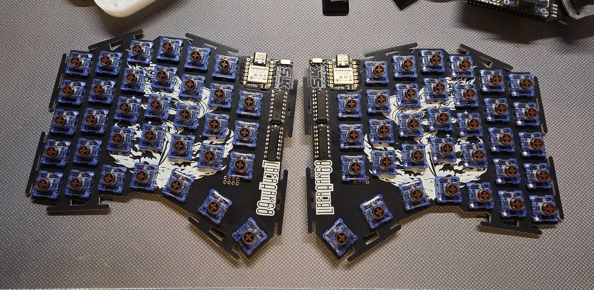

# LiberArk68

A 68-key wireless split mechanical keyboard with a column-staggered layout, rotated thumb cluster, and a dedicated dongle for ZMK Studio.

## Hardware

- **MCU**: 3× [Seeed Studio XIAO nRF52840](https://wiki.seeedstudio.com/XIAO_BLE/) — one per half, one for the dongle
- **Matrix**: 3 rows × 12 columns per half (34 keys per side; row 2 has 10 keys)
  - Rows: driven directly from MCU GPIOs (D0–D2)
  - Columns: two daisy-chained [74HC595](https://www.ti.com/product/SN74HC595) shift registers per side, fed over SPI (D3 = CS, D8 = SCLK, D10 = MOSI), giving 16 virtual GPIOs of which 12 are used
- **Diodes**: switch → diode → row (col2row scanning)
- **Connectivity**: BLE; each half is a peripheral, the third XIAO is the BLE central
- **Dongle**: [Prospector](https://github.com/carrefinho/prospector-zmk-module) adapter with an ST7789 LCD for live status (layer, modifiers, battery)
- **VIK connector** on each half for future peripherals (encoder, trackpad, etc.)

## Firmware

This repo is a [ZMK](https://zmk.dev) user config. The shield lives in [`boards/shields/liberark68/`](boards/shields/liberark68/) and includes:

| File | Purpose |
|---|---|
| `liberark68.dtsi` | Shared matrix transform + physical layout (used by Studio) |
| `liberark68_kscan.dtsi` | SPI + 595 + kscan, shared by both halves |
| `liberark68_left.overlay` | Left half (peripheral) |
| `liberark68_right.overlay` | Right half (peripheral) — applies `row-offset = <3>` to map into the right slice of the combined matrix |
| `liberark68_dongle.overlay` | Dongle (BLE central) — no local kscan |
| `liberark68.keymap` | Base layer + four placeholder layers (`L1`–`L4`) |
| `Kconfig.shield` / `Kconfig.defconfig` | Shield declarations and split-role defaults |
| `*.conf` | Per-target Kconfig overrides (Studio, status screen, sleep) |

ZMK Studio is enabled on the dongle, so layers 1–4 can be edited live without re-flashing.

## Building

CI builds run automatically on every push via [`.github/workflows/build.yml`](.github/workflows/build.yml). Targets defined in [`build.yaml`](build.yaml):

- `liberark68_left` — left half firmware
- `liberark68_right` — right half firmware
- `liberark68_dongle prospector_adapter` — dongle with Studio + Prospector display
- `settings_reset` — wipes the settings partition on any board (re-pairing, recovery)

Built artifacts are downloadable from the Actions run page as a `firmware.zip` containing four `.uf2` files.

## Flashing

1. Double-tap the reset button on the target board to enter UF2 bootloader mode
2. Drag the matching `.uf2` onto the `XIAO-SENSE` USB mass-storage drive that appears
3. The board reboots automatically

**Order matters for pairing**: flash the dongle first, then pair the left half, then the right half. Prospector arranges its battery widgets in pairing order.

If pairings ever get wedged, flash `settings_reset.uf2` onto the misbehaving board to wipe its settings partition, then re-flash the normal firmware.

## ZMK Studio

With the dongle plugged in via USB, open [zmk.studio](https://zmk.studio) (Chrome / Edge) and connect. The keyboard will render with its actual column-staggered geometry and rotated thumbs. Edits persist to the dongle's storage and survive power cycles.

## Layout

68 keys total, 34 per side:

- **Row 0** (top, 12+12): number row + outer/inner edges
- **Row 1** (middle, 12+12): home row + edges
- **Row 2** (10+10): bottom mods + rotated thumb cluster (3 thumbs per side at 15°/25°/40°)
- Three momentary layers wired in the KLE: `&mo 4` (left outer), `&mo 2` (left thumb), `&mo 3` (right thumb)

The matrix-transform map and bindings array follow this order: L row 0 cols 0–11, R row 0 cols 0–11, L row 1 cols 0–11, R row 1 cols 0–11, L row 2 cols 0–9, R row 2 cols 0–9.

## Credits

- [ZMK](https://zmk.dev) — firmware
- [carrefinho/prospector-zmk-module](https://github.com/carrefinho/prospector-zmk-module) — dongle display + status screens
